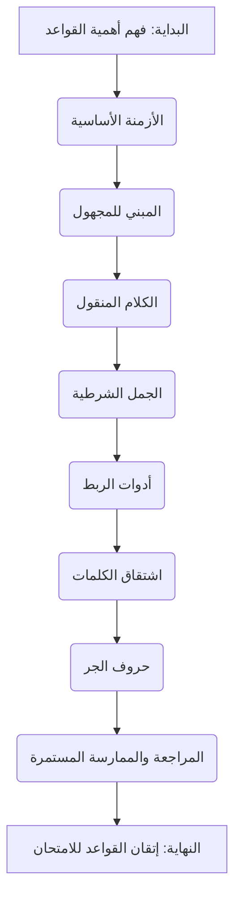

# نظرة عامة على القواعد (Grammar Overview)

## أهداف التعلم

بعد إكمال هذا الدرس، ستكون قادرًا على:

*   فهم أهمية القواعد النحوية في اللغة الإنجليزية وامتحان البكالوريا.
*   التعرف على كيفية تصميم أسئلة القواعد في الامتحان.
*   تحديد الدروس النحوية الأكثر تكرارًا في امتحانات البكالوريا السابقة.
*   تطوير استراتيجية فعالة لدراسة القواعد النحوية.
*   تجنب الأخطاء الشائعة في استخدام القواعد.

## وقت القراءة المقدر

ساعة (1) إلى ساعة ونصف (1.5).

## مستوى الصعوبة

متوسط.

## جدول المحتويات

1.  لماذا القواعد مهمة؟
2.  كيف تُصمم أسئلة القواعد في البكالوريا؟
3.  دروس القواعد الأكثر شيوعًا.
4.  كيف تدرس القواعد بفعالية؟
5.  خريطة طريق لدراسة القواعد.
6.  نصائح أساسية.
7.  ملخص.
8.  روابط التنقل.

## 1. لماذا القواعد مهمة؟

القواعد النحوية هي العمود الفقري لأي لغة، واللغة الإنجليزية ليست استثناءً. في امتحان البكالوريا، لا تقتصر أهمية القواعد على قسم "إتقان اللغة" فقط، بل تمتد لتشمل جميع الأقسام:

*   **فهم النص:** فهم بنية الجمل يساعدك على استيعاب المعنى الدقيق للنص.
*   **التعبير الكتابي:** استخدام القواعد الصحيحة ضروري لكتابة نصوص واضحة، متماسكة، وخالية من الأخطاء، مما يؤثر بشكل مباشر على علامتك.
*   **التواصل:** في الحياة اليومية، تضمن القواعد الصحيحة أن رسالتك تصل بوضوح ودون سوء فهم.

> 💡 **نصيحة:** لا تنظر إلى القواعد كقائمة من القوانين الصارمة، بل كأدوات تساعدك على بناء جمل ذات معنى وفعالية.

## 2. كيف تُصمم أسئلة القواعد في البكالوريا؟

تتنوع أسئلة القواعد في امتحان البكالوريا لتقييم جوانب مختلفة من فهمك واستخدامك لها. إليك بعض الأنماط الشائعة:

*   **إعادة صياغة الجمل (Rewriting Sentences):** يُطلب منك إعادة كتابة جملة باستخدام كلمة أو بنية نحوية معينة مع الحفاظ على المعنى الأصلي.
*   **ملء الفراغات (Gap Filling):** إكمال الفراغات في جمل أو فقرات بالصيغة الصحيحة للأفعال، الضمائر، حروف الجر، أو أدوات الربط.
*   **تصحيح الأخطاء (Error Correction):** تحديد وتصحيح الأخطاء النحوية في جمل معطاة.
*   **مطابقة الجمل (Matching):** ربط أجزاء الجمل لتكوين جمل صحيحة نحويًا ومنطقيًا.

> ⚠️ **تحذير:** غالبًا ما تركز الأسئلة على الفروقات الدقيقة والاستثناءات. لذا، الفهم العميق وليس الحفظ السطحي هو المفتاح.

## 3. دروس القواعد الأكثر شيوعًا

بناءً على تحليل امتحانات البكالوريا السابقة، هناك بعض الدروس النحوية التي تتكرر بشكل كبير. التركيز عليها سيمنحك ميزة كبيرة:

| الدرس النحوي         | أمثلة على الاستخدام في الامتحان                                                                |
| :------------------- | :------------------------------------------------------------------------------------------ |
| الأزمنة (Tenses)      | الماضي البسيط، الماضي التام، المضارع التام، المستقبل البسيط، الأفعال الشرطية.                 |
| المبني للمجهول (Passive Voice) | تحويل الجمل من المبني للمعلوم إلى المبني للمجهول والعكس.                                    |
| الكلام المنقول (Reported Speech) | تحويل الكلام المباشر إلى كلام منقول مع تغيير الأزمنة والضمائر.                               |
| الجمل الشرطية (Conditionals) | استخدام أنواع الجمل الشرطية (Type 0, 1, 2, 3) بشكل صحيح.                                     |
| أدوات الربط (Linking Words) | استخدام أدوات الربط المناسبة (e.g., although, however, in addition) لربط الأفكار.             |
| اشتقاق الكلمات (Word Formation) | تحويل الكلمات من اسم إلى فعل، أو صفة إلى ظرف، وهكذا.                                        |
| حروف الجر (Prepositions) | استخدام حروف الجر الصحيحة مع الأفعال والأسماء.                                              |

## 4. كيف تدرس القواعد بفعالية؟

دراسة القواعد لا تعني حفظ القواعد فقط. إليك منهجية فعالة:

1.  **افهم القاعدة:** لا تحفظ القاعدة دون فهم. اسأل دائمًا "لماذا؟" و "كيف؟".
2.  **شاهد الأمثلة:** الأمثلة توضح كيفية تطبيق القاعدة. ابحث عن أمثلة متنوعة.
3.  **طبق القاعدة:** حل التمارين بانتظام. هذا هو الجزء الأكثر أهمية. الممارسة تجعل القاعدة راسخة.
4.  **راجع الأخطاء:** لا تتجاهل أخطائك. افهم سبب الخطأ وصححه. هذا يمنع تكرارها.
5.  **استخدمها في الكتابة والتحدث:** حاول دمج القواعد التي تعلمتها في كتاباتك ومحادثاتك اليومية.

## 5. خريطة طريق لدراسة القواعد

إليك خريطة طريق مقترحة لدراسة القواعد، مع التركيز على التسلسل المنطقي:

> 📝 **ملاحظة:** هذه الخريطة ليست جامدة. يمكنك تعديلها لتناسب احتياجاتك ومستواك، ولكن تذكر أن التسلسل مهم لبناء الفهم.

## 6. نصائح أساسية

*   **لا تخف من الأخطاء:** الأخطاء جزء طبيعي من عملية التعلم. تعلم منها.
*   **استخدم الموارد المتاحة:** الكتب، المواقع الإلكترونية، مقاطع الفيديو التعليمية.
*   **اطلب المساعدة:** إذا واجهت صعوبة في فهم قاعدة معينة، لا تتردد في سؤال معلمك أو زملائك.
*   **المراجعة الدورية:** خصص وقتًا لمراجعة القواعد القديمة بانتظام.

## 7. ملخص

القواعد النحوية هي حجر الزاوية في إتقان اللغة الإنجليزية والنجاح في امتحان البكالوريا. من خلال فهم أهميتها، التعرف على أنماط الأسئلة، والتركيز على الدروس الأكثر شيوعًا، وتطبيق استراتيجية دراسة فعالة، ستتمكن من بناء أساس قوي يمكنك من التعبير عن نفسك بوضوح ودقة، وتحقيق أعلى الدرجات في هذا القسم.

## 8. روابط التنقل

*   ⬅️ [نظرة عامة على فهم النص](reading-comprehension-overview.md)
*   ➡️ [نظرة عامة على التعبير الكتابي](writing-overview.md)
*   📚 [العودة إلى خريطة التعلم الرئيسية](../../LEARNING_ROADMAP.md)
